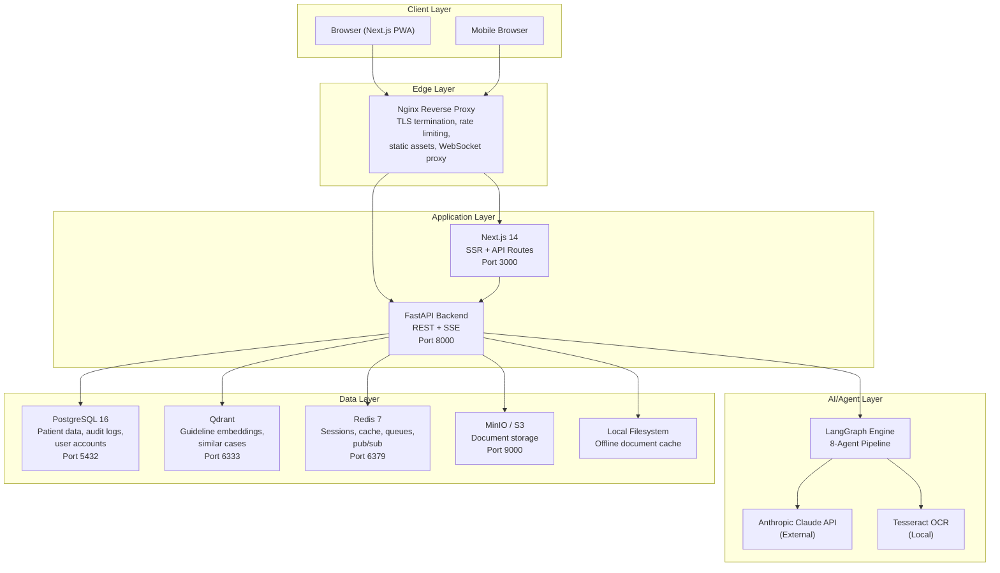
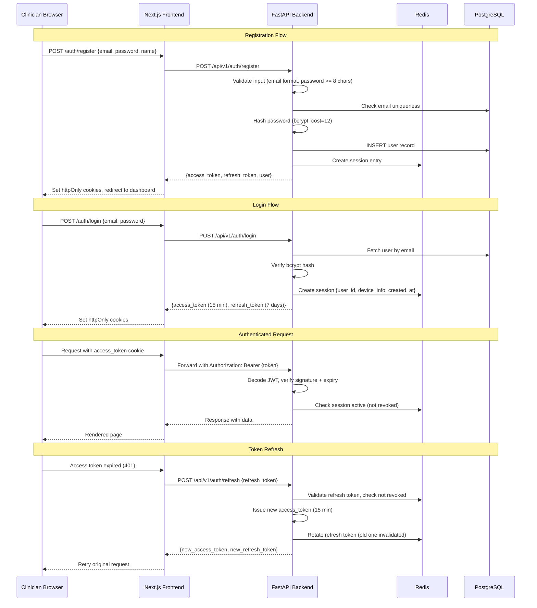
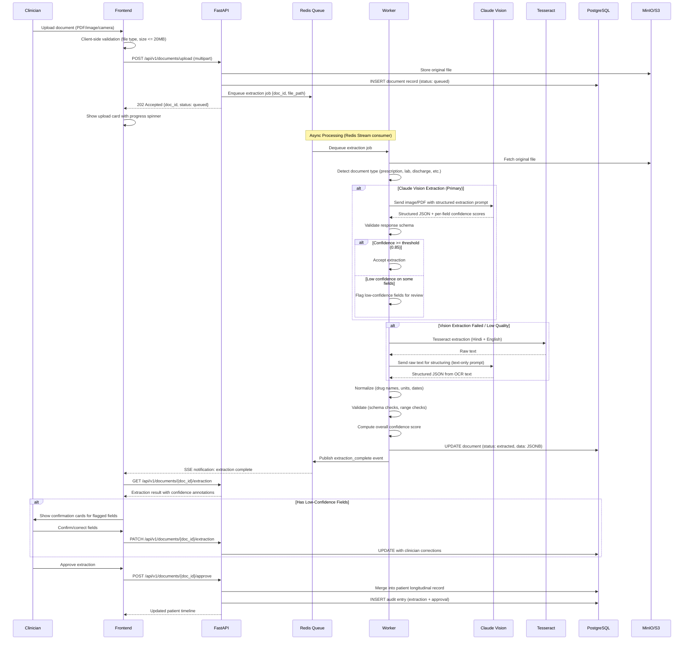

# Aether Clinician -- System Design Document

**Product:** Aether Clinician -- Clinician-Facing Diagnostic & Management Decision-Support System  
**Version:** 1.0  
**Last Updated:** 2026-06-27  
**Status:** Living document  

---

## Table of Contents

1. [Overview](#1-overview)
2. [Tech Stack Decisions](#2-tech-stack-decisions)
3. [Infrastructure Design](#3-infrastructure-design)
4. [Authentication & Authorization](#4-authentication--authorization)
5. [File Processing Pipeline](#5-file-processing-pipeline)
6. [Caching Strategy](#6-caching-strategy)
7. [Error Handling Patterns](#7-error-handling-patterns)
8. [Logging & Monitoring](#8-logging--monitoring)
9. [Performance Considerations](#9-performance-considerations)
10. [Scalability Path](#10-scalability-path)

---

## 1. Overview

Aether Clinician is a diagnostic and management decision-support system designed for primary-care physicians practicing in rural and semi-urban India. The system addresses three core problems:

1. **Fragmented patient histories** -- Medical records in these settings are scattered across paper prescriptions, handwritten notes, scanned PDFs, and photographs. There is no structured longitudinal record.
2. **Limited specialist access** -- Clinicians make complex diagnostic and management decisions without easy access to specialist consultation or up-to-date clinical guidelines.
3. **Drug safety in polypharmacy** -- Patients often carry prescriptions from multiple providers with no unified medication reconciliation.

The system is built around a **multi-agent diagnostic reasoning engine** -- eight specialized agents orchestrated via LangGraph that collaboratively analyze patient data, produce grounded differential diagnoses with cited evidence, perform drug-safety checks, and generate guideline-aligned management suggestions.

### Design Principles

- **Offline-first for core workflows.** Patient record access and rule-based drug safety checks must work without internet. LLM-powered features degrade gracefully.
- **Clinician-in-the-loop.** The system never makes autonomous clinical decisions. Every AI suggestion requires explicit clinician review.
- **Data residency.** All patient data stays within India-region infrastructure (DPDP Act compliance).
- **Transparency.** Every diagnostic suggestion carries its evidence chain, and the full reasoning trace is available for audit.
- **Low-resource tolerance.** The system must run on modest hardware with intermittent connectivity.

---

## 2. Tech Stack Decisions

### Core Stack

| Component | Technology | Version | Rationale |
|---|---|---|---|
| **Backend** | Python / FastAPI | 3.12+ / 0.110+ | Native async support for concurrent LLM calls and I/O-bound extraction work. Best-in-class ML/AI ecosystem (LangGraph, LangChain, spaCy, scikit-learn). Pydantic integration gives end-to-end type safety from API schema to database models. Medical NLP libraries (MedSpaCy, scispaCy) are Python-native. Fast prototyping velocity for an early-stage product. |
| **Frontend** | Next.js / React / TypeScript | 14 / 18 / 5.4+ | Server-side rendering delivers fast initial paint on slow 3G/4G connections common in target deployment areas. App Router supports streaming for progressive rendering of agent reasoning output. TypeScript enforces compile-time safety across the UI. React component model enables reusable clinical UI primitives (patient cards, medication lists, evidence panels). |
| **Database** | PostgreSQL | 16 | JSONB columns handle semi-structured medical data (variable lab report formats, prescription schemas) without requiring rigid schemas upfront. Strong relational model for the patient graph (patients, encounters, medications, conditions, documents). GIN indexes on JSONB for fast structured queries within unstructured data. Mature migration tooling via Alembic. Append-only audit log pattern with `INSERT`-only audit tables. |
| **Vector Store** | Qdrant | 1.9+ | Purpose-built for vector similarity search with metadata filtering -- needed for semantic retrieval of guideline chunks and similar patient presentations. Self-hostable (critical for India data residency -- no data leaves the region). Simpler operational model than Pinecone (managed, US-based) or Weaviate (heavier footprint) for a single-tenant deployment. Supports payload filtering for scoped searches (e.g., search guidelines only within a specialty). |
| **Cache** | Redis | 7+ | In-memory store for session management (JWT token blocklist, active sessions), extraction job queues (Redis Streams), patient record cache (assembled longitudinal views), and pub/sub for real-time reasoning theatre updates (streaming agent reasoning to the frontend via SSE). Single dependency for four infrastructure concerns. |
| **AI/LLM** | Anthropic Claude | claude-sonnet-4-20250514 | Multimodal vision capability enables direct structured extraction from scanned documents, prescriptions, and lab reports -- the primary data ingestion path. Large context window (200K tokens) handles full patient longitudinal records in a single reasoning pass. Strong clinical reasoning and citation grounding. Function-calling support maps directly to agent tool definitions in LangGraph. |
| **OCR Fallback** | Tesseract | 5.x | Handles low-quality scans, faded prescriptions, and handwritten text where Claude vision produces low-confidence or failed extractions. Runs locally with no network dependency. Hindi + English language packs for bilingual medical documents common in Indian clinical settings. |
| **Agent Orchestration** | LangGraph | 0.2+ | Stateful graph execution model maps naturally to the multi-agent diagnostic pipeline. Conditional edges enable dynamic routing (e.g., skip pharmacology agent if no medications). Shared `CaseState` object provides a single source of truth across agents. Built-in checkpointing enables pause/resume for long-running analyses. Human-in-the-loop primitives for clinician confirmation at critical decision points. |

### Infrastructure & Tooling

| Component | Technology | Rationale |
|---|---|---|
| **Auth** | JWT (access/refresh) + bcrypt | Stateless access tokens reduce database round-trips. Bcrypt with cost factor 12 for password hashing. Demo mode: no credential gating to reduce friction for evaluation. |
| **File Storage** | Local filesystem + S3-compatible (MinIO for dev) | MinIO provides S3-compatible API for development without AWS dependency. Production will use S3-compatible India-region storage. Local filesystem fallback for offline mode. |
| **Monorepo** | Turborepo | Build caching across Python and TypeScript workspaces. Task orchestration for parallel test/lint/build. Good polyglot support -- runs Python tasks via custom pipeline definitions alongside native TypeScript/Next.js builds. |
| **Containerization** | Docker / Docker Compose | Single-command deployment for the full stack. Reproducible environments across dev and deployment. Compose profiles for dev (with MinIO, hot-reload) vs production. |
| **Reverse Proxy** | Nginx | TLS termination, static file serving for Next.js assets, WebSocket proxy for reasoning theatre, rate limiting, and request buffering for file uploads. |

---

## 3. Infrastructure Design

### Deployment Architecture

The initial deployment target is a single-server Docker Compose stack. All services run on one machine, with Nginx as the entry point. This keeps operational complexity low while the product is in early deployment and evaluation.



### Docker Compose Service Map

```yaml
# Illustrative service structure (not runnable config)
services:
  nginx:        # Reverse proxy, TLS, static assets
  frontend:     # Next.js 14 (SSR + client)
  backend:      # FastAPI (API + agent orchestration)
  postgres:     # PostgreSQL 16 (primary data store)
  qdrant:       # Qdrant (vector store)
  redis:        # Redis 7 (cache, sessions, queues, pub/sub)
  minio:        # MinIO (S3-compatible file storage, dev only)
```

### Network Topology

All services communicate over a single Docker bridge network. No service port is exposed to the host except Nginx (443/80). Inter-service communication uses Docker DNS (service names as hostnames).

```
External Traffic
       |
       v
   [Nginx:443] ---- TLS termination
       |
       +---> [frontend:3000]  (SSR pages, static assets)
       +---> [backend:8000]   (API, SSE, WebSocket)
                  |
                  +---> [postgres:5432]
                  +---> [qdrant:6333]
                  +---> [redis:6379]
                  +---> [minio:9000]
                  +---> Claude API (external HTTPS)
```

### Data Residency

All infrastructure runs within India-region servers. The only external call is to the Anthropic Claude API. Patient data is never sent raw to the LLM -- documents are processed with de-identification where possible, and the API call contains extracted/structured content, not raw patient identifiers. A data flow audit log tracks every outbound API call with a hash of the payload content.

### Offline Mode Architecture

The system is designed for intermittent connectivity. When the network is unavailable:

| Capability | Online | Offline |
|---|---|---|
| Patient record viewing | Full longitudinal view | Cached records from last sync |
| Document upload | Immediate processing | Queued locally, processed on reconnect |
| AI diagnostic reasoning | Full 8-agent pipeline | Unavailable -- banner: "AI reasoning paused -- offline" |
| Drug safety checks | LLM-enhanced with guidelines | Rule-based engine (local drug interaction DB) |
| New patient creation | Full | Local-only, synced on reconnect |
| Guideline search | Semantic (vector) search | Keyword search on cached guidelines |

The frontend detects connectivity via periodic health-check pings to `/api/health`. On failure, the UI transitions to offline mode with a persistent "Offline Mode" indicator and disables features that require LLM access.

---

## 4. Authentication & Authorization

### Design Decisions

This is a **demo build** intended for evaluation by clinicians and stakeholders. The authentication system is functional but deliberately lightweight:

- **No clinician credential verification** -- users sign up with email and password without medical license validation. Production builds will integrate with the Indian Medical Register for MCI/NMC verification.
- **Persistent demo banner** -- a dismissible (but re-appearing on session start) banner reads: *"Demo build -- decision-support only, not for real patient care."*
- **Full audit trail** -- despite being a demo, every action is tied to an authenticated account for accountability.

### Auth Flow



### Token Design

**Access Token (JWT)**
```
Header:  { alg: "HS256", typ: "JWT" }
Payload: {
  sub: "user_uuid",
  email: "doctor@clinic.in",
  name: "Dr. Priya Sharma",
  iat: 1719475200,
  exp: 1719476100,       // 15-minute expiry
  jti: "unique-token-id" // for revocation tracking
}
```

**Refresh Token**: Opaque 256-bit random string stored in Redis with a 7-day TTL. Bound to the user ID and device fingerprint. Rotated on every use (one-time use).

### Session Management

Sessions are tracked in Redis with the following structure:

```
session:{session_id} -> {
  user_id: "uuid",
  device_info: "Chrome/126 on Windows",
  ip_address: "192.168.1.x",  // truncated for privacy
  created_at: "2026-06-27T10:00:00Z",
  last_active: "2026-06-27T10:30:00Z",
  refresh_token_hash: "sha256(...)"
}
TTL: 7 days (aligned with refresh token)
```

A user can have multiple active sessions (phone + laptop). All sessions are listed in the account settings page. Revoking a session deletes the Redis key and adds the access token `jti` to a short-lived blocklist (15-minute TTL, matching access token lifetime).

### Authorization Model

For the demo build, authorization is flat -- all authenticated users have the same permissions. The data model supports role-based access for future expansion:

| Role | Permissions | Status |
|---|---|---|
| `clinician` | Full access to own patients, create/read/update records, run diagnostics | Active (demo default) |
| `admin` | User management, system configuration, audit log access | Planned |
| `reviewer` | Read-only access to anonymized cases for quality review | Planned |

### Security Headers

All responses include:
- `Strict-Transport-Security: max-age=31536000; includeSubDomains`
- `X-Content-Type-Options: nosniff`
- `X-Frame-Options: DENY`
- `Content-Security-Policy: default-src 'self'; ...`
- `X-Request-Id: {correlation_id}` (for tracing)

### CSRF Protection

State-changing requests require a CSRF token. The token is generated server-side, stored in Redis alongside the session, and sent to the client as a non-httpOnly cookie. The frontend reads it from the cookie and includes it in request headers (`X-CSRF-Token`). The backend validates the header value against the Redis-stored value.

---

## 5. File Processing Pipeline

### Overview

The file processing pipeline transforms unstructured clinical documents (scanned prescriptions, lab reports, discharge summaries) into structured, normalized, clinician-verified patient records. This is the primary data ingestion path and the foundation for all downstream reasoning.

### Supported Input Formats

| Format | Source | Notes |
|---|---|---|
| PDF | Scanned documents, digital lab reports | May be multi-page, may contain embedded images |
| JPEG/PNG | Camera captures, WhatsApp-forwarded photos | Often low quality, variable lighting |
| Camera capture | In-app camera | Guided capture with framing overlay |

### Pipeline Architecture



### Pipeline Stages in Detail

#### Stage 1: Upload & Validation

- **Client-side**: File type check (PDF, JPEG, PNG), size limit (20MB), basic corruption check.
- **Server-side**: MIME type verification (magic bytes, not just extension), virus scan stub (placeholder for production AV integration), image dimension check (reject if < 200x200 px -- too small to extract).
- **Storage**: Original file stored in S3/MinIO with path `/{patient_id}/documents/{doc_id}/{original_filename}`. Metadata recorded in PostgreSQL.

#### Stage 2: Multimodal Extraction

The primary extraction path sends the document to Claude's vision API with a structured extraction prompt. The prompt is document-type-aware:

- **Prescription prompt**: Extract medications (name, dosage, frequency, duration), prescribing doctor, date, diagnosis notes.
- **Lab report prompt**: Extract test names, values, units, reference ranges, lab name, date.
- **Discharge summary prompt**: Extract admission/discharge dates, diagnoses, procedures, medications at discharge, follow-up instructions.

Each extraction returns a structured JSON response with **per-field confidence scores** (0.0 to 1.0) generated by the LLM's self-assessment.

#### Stage 3: OCR Fallback

Triggered when:
- Claude vision returns an error (rate limit, timeout)
- Overall extraction confidence is below 0.5
- Document is flagged as handwritten (detected via image analysis heuristic)

Tesseract runs with Hindi (`hin`) and English (`eng`) language packs. The raw OCR text is then sent to Claude (text-only mode) for structuring.

#### Stage 4: Normalization

- **Drug names**: Mapped to a canonical `DrugVocabulary` table (generic name, brand names, ATC code). Fuzzy matching with Levenshtein distance for misspellings. Unmatched drugs flagged for clinician resolution.
- **Units**: Standardized to SI units with conversion factors (e.g., "mg/dl" to "mmol/L" for glucose).
- **Dates**: Parsed from multiple Indian date formats (DD/MM/YYYY, DD-MM-YY, Hindi month names) into ISO 8601.
- **Doctor names / Hospital names**: Normalized against known provider registry (when available).

#### Stage 5: Validation

- **Schema validation**: Pydantic models enforce required fields per document type.
- **Range checks**: Lab values validated against physiologically plausible ranges (e.g., hemoglobin 0-25 g/dL). Out-of-range values flagged, not rejected.
- **Temporal validation**: Document date must not be in the future. Medication durations must be positive.
- **Cross-field consistency**: Medication dosage consistent with drug's known dosing range.

#### Stage 6: Confidence Scoring

Each extracted field carries a confidence score. The **document-level confidence** is the weighted average, with clinically critical fields (medications, diagnoses) weighted 2x. Thresholds:

| Confidence | Action |
|---|---|
| >= 0.85 | Auto-accepted, shown as confirmed |
| 0.50 -- 0.84 | Shown for clinician review with highlight |
| < 0.50 | Marked as "needs manual entry" |

#### Stage 7: Clinician Confirmation

The frontend presents extraction results as editable cards. Low-confidence fields are highlighted in amber. The clinician can:
- Accept the extracted value
- Correct the value (free-text or dropdown for coded fields)
- Mark a field as "not present in document"
- Reject the entire extraction and manually enter data

All corrections are recorded in the audit log with both the original extracted value and the clinician's correction.

#### Stage 8: Patient Graph Update

Approved extractions are merged into the patient's longitudinal record:
- New medications added to the active medication list (with start date, prescriber)
- Lab results appended to the lab timeline
- Diagnoses added to the problem list (with date of onset if available)
- The patient record cache in Redis is invalidated

---

## 6. Caching Strategy

### Cache Layers

```
Request Flow:
Browser -> Nginx (static cache) -> Next.js (RSC cache) -> FastAPI -> Redis -> PostgreSQL/Qdrant
```

### Cache Definitions

| Cache | Store | Key Pattern | TTL | Invalidation |
|---|---|---|---|---|
| **Patient record** | Redis | `patient:{id}:record` | 30 min | On new document ingestion, extraction approval, or manual edit |
| **Patient list** | Redis | `user:{id}:patients:page:{n}` | 5 min | On new patient creation or record update |
| **Guideline chunks** | Redis | `guideline:{chunk_hash}` | 24 hours | On guideline database update (manual trigger) |
| **Extraction results** | Redis | `extraction:{doc_hash}` | 7 days | Never (immutable -- same document always produces same extraction attempt) |
| **Session data** | Redis | `session:{session_id}` | 7 days | On logout or explicit revocation |
| **CSRF tokens** | Redis | `csrf:{session_id}` | 7 days | On session expiry |
| **Drug vocabulary** | Redis | `drugvocab:all` | 24 hours | On vocabulary update |
| **Agent reasoning cache** | Redis | `reasoning:{case_hash}` | 1 hour | On patient record change or new data |

### Cache Warming

On user login, the following caches are warmed proactively:
- Recent patients list (last 20 patients by interaction date)
- Drug vocabulary (full set -- typically < 5MB)
- User preferences and settings

### Cache-Aside Pattern

All caches use the cache-aside (lazy-loading) pattern:

```python
async def get_patient_record(patient_id: str) -> PatientRecord:
    cache_key = f"patient:{patient_id}:record"

    # 1. Check cache
    cached = await redis.get(cache_key)
    if cached:
        return PatientRecord.model_validate_json(cached)

    # 2. Cache miss -- build from database
    record = await build_longitudinal_record(patient_id)

    # 3. Populate cache
    await redis.setex(cache_key, 1800, record.model_dump_json())

    return record
```

### Extraction Deduplication

Before processing a new document, the pipeline computes a SHA-256 hash of the file content and checks the extraction cache. If a matching hash exists, the previous extraction result is returned immediately, saving LLM API cost and processing time. The clinician is notified that this document was previously processed.

---

## 7. Error Handling Patterns

### Error Response Schema

All API errors follow a consistent structure:

```json
{
  "error": {
    "code": "EXTRACTION_FAILED",
    "message": "Document extraction failed after 3 attempts",
    "details": {
      "document_id": "doc_abc123",
      "attempts": 3,
      "last_error": "LLM rate limit exceeded"
    },
    "correlation_id": "req_7f3a2b1c",
    "timestamp": "2026-06-27T10:30:00Z"
  }
}
```

### Error Categories and Handling

#### LLM Failures

```python
# Retry with exponential backoff
class LLMRetryPolicy:
    max_retries: int = 3
    base_delay: float = 1.0      # seconds
    max_delay: float = 30.0      # seconds
    backoff_factor: float = 2.0

    # Retry sequence: 1s -> 2s -> 4s (with jitter)

# After max retries exhausted:
# 1. Log the failure with full context
# 2. If extraction: flag document as "extraction_failed", notify clinician
# 3. If reasoning: degrade to offline mode
# 4. Set circuit breaker -- after 5 failures in 60s, stop calling LLM for 120s
```

**Circuit Breaker States:**
- **Closed** (normal): All LLM requests proceed.
- **Open** (tripped): LLM requests immediately return offline-mode response. Checked every 120s.
- **Half-Open** (testing): One request allowed through. Success closes the breaker; failure re-opens it.

#### Extraction Failures

Extraction failures **never silently drop data**. Every failure path results in either a retry, a fallback, or a clinician notification:

```
Document Upload
    |
    v
Claude Vision Extraction
    |
    +-- Success (confidence >= 0.5) --> Normalize --> Validate --> Clinician Review
    |
    +-- Failure / Low Confidence
            |
            v
        Tesseract OCR Fallback
            |
            +-- Success --> Re-structure via LLM --> Normalize --> Clinician Review
            |
            +-- Failure --> Flag as "manual_entry_required"
                            |
                            v
                        Clinician notified: "Could not extract this document.
                        Please enter data manually."
                        Document stored for future re-processing.
```

#### Agent Pipeline Failures

Individual agent failures do not crash the diagnostic pipeline. The system uses a **partial-result tolerance** model:

```python
# Each agent runs independently within the LangGraph pipeline
# The Verifier agent (final stage) notes missing inputs

class CaseState(TypedDict):
    patient_record: PatientRecord
    agent_results: dict[str, AgentResult | AgentError]
    #                     ^-- keyed by agent name
    # AgentError includes: error_type, message, timestamp

# Example: If the Pharmacology Agent fails:
# - Other agents continue with available data
# - Verifier output includes:
#   "Note: Drug interaction analysis unavailable (Pharmacology Agent error).
#    Management recommendations do not account for drug interactions.
#    Manual drug interaction review recommended."
```

#### Network Failures

```python
# Operation queue for offline resilience
class OfflineQueue:
    """
    Operations that failed due to network issues are queued
    in IndexedDB (frontend) or SQLite (backend) and retried
    when connectivity is restored.
    """

    # Queued operations:
    # - Document uploads (file stored locally)
    # - Patient record updates
    # - Extraction jobs

    # NOT queued (require fresh context):
    # - Diagnostic reasoning requests
    # - Guideline searches

    # Retry policy: on reconnect, process queue FIFO
    # Conflict resolution: last-write-wins with clinician notification
```

### Error Codes Reference

| Code | HTTP Status | Meaning |
|---|---|---|
| `AUTH_INVALID_CREDENTIALS` | 401 | Email or password incorrect |
| `AUTH_TOKEN_EXPIRED` | 401 | Access token expired, use refresh |
| `AUTH_SESSION_REVOKED` | 401 | Session has been revoked |
| `PATIENT_NOT_FOUND` | 404 | Patient ID does not exist |
| `DOCUMENT_TOO_LARGE` | 413 | File exceeds 20MB limit |
| `DOCUMENT_INVALID_TYPE` | 415 | Unsupported file format |
| `EXTRACTION_FAILED` | 502 | All extraction attempts failed |
| `EXTRACTION_LOW_CONFIDENCE` | 200 | Extraction succeeded but with low-confidence fields (not an error, included in response) |
| `LLM_UNAVAILABLE` | 503 | LLM API unreachable, circuit breaker open |
| `LLM_RATE_LIMITED` | 429 | LLM rate limit hit, retry after delay |
| `AGENT_PARTIAL_FAILURE` | 200 | Some agents failed; partial results returned with warnings |
| `OFFLINE_MODE` | 503 | Feature unavailable in offline mode |
| `VALIDATION_ERROR` | 422 | Request validation failed (Pydantic) |

---

## 8. Logging & Monitoring

### Logging Architecture

```
Application Code
    |
    v
structlog (Python) / pino (Next.js)
    |
    v
Structured JSON Logs
    |
    +---> stdout (Docker logs)
    +---> Log files (rotated, /var/log/aether/)
    +---> (Future: ELK/Loki for aggregation)
```

### Log Categories

#### 1. Request/Response Logs

Every API request is logged with a correlation ID that flows through the entire request lifecycle:

```json
{
  "timestamp": "2026-06-27T10:30:00.123Z",
  "level": "info",
  "event": "http_request",
  "correlation_id": "req_7f3a2b1c",
  "method": "POST",
  "path": "/api/v1/documents/upload",
  "user_id": "usr_abc123",
  "status_code": 202,
  "duration_ms": 145,
  "request_size_bytes": 2048576,
  "response_size_bytes": 256
}
```

#### 2. Agent Trace Logs

Every LLM call, tool invocation, and decision within the agent pipeline is logged:

```json
{
  "timestamp": "2026-06-27T10:30:05.456Z",
  "level": "info",
  "event": "agent_step",
  "correlation_id": "req_7f3a2b1c",
  "case_id": "case_xyz789",
  "agent": "differential_diagnosis",
  "step": "llm_call",
  "model": "claude-sonnet-4-20250514",
  "prompt_tokens": 4200,
  "completion_tokens": 1800,
  "duration_ms": 3200,
  "tool_calls": ["search_guidelines", "get_lab_values"],
  "decision": "Added 'Type 2 Diabetes' to differential (confidence: 0.82)"
}
```

#### 3. Clinical Audit Log

**Immutable, append-only** log of every clinical suggestion and clinician decision. This is a compliance and safety requirement:

```sql
CREATE TABLE audit_log (
    id              BIGSERIAL PRIMARY KEY,
    timestamp       TIMESTAMPTZ NOT NULL DEFAULT now(),
    user_id         UUID NOT NULL REFERENCES users(id),
    action          TEXT NOT NULL,  -- e.g., 'diagnostic_suggestion_viewed',
                                   --       'management_accepted',
                                   --       'extraction_corrected'
    patient_id      UUID REFERENCES patients(id),
    case_id         UUID,
    detail          JSONB NOT NULL,
    -- detail contains:
    --   For diagnostic suggestions: full differential with evidence
    --   For management plans: suggested plan + guideline citations
    --   For extractions: original vs corrected values
    --   For drug safety: flagged interactions + clinician decision
    correlation_id  TEXT,
    ip_address      INET
);

-- Append-only enforcement: no UPDATE or DELETE grants on this table
-- The application database user has INSERT-only permission
```

#### 4. Performance Metrics

Collected via application instrumentation, exposed at `/metrics` (Prometheus-compatible format for future integration):

| Metric | Type | Description |
|---|---|---|
| `extraction_duration_seconds` | Histogram | Time from upload to extraction complete |
| `extraction_confidence_score` | Histogram | Distribution of document-level confidence scores |
| `agent_execution_seconds` | Histogram | Per-agent execution time (labeled by agent name) |
| `llm_request_duration_seconds` | Histogram | LLM API call latency |
| `llm_tokens_total` | Counter | Total tokens consumed (labeled by model, direction) |
| `llm_errors_total` | Counter | LLM API errors (labeled by error type) |
| `cache_hits_total` | Counter | Cache hits (labeled by cache name) |
| `cache_misses_total` | Counter | Cache misses (labeled by cache name) |
| `active_sessions` | Gauge | Current active user sessions |
| `document_queue_depth` | Gauge | Number of documents waiting for extraction |
| `circuit_breaker_state` | Gauge | LLM circuit breaker state (0=closed, 1=open, 2=half-open) |

### Health Check Endpoints

| Endpoint | Purpose | Checks |
|---|---|---|
| `GET /health` | Load balancer health | Returns 200 if process is running |
| `GET /health/ready` | Readiness probe | PostgreSQL connected, Redis connected, Qdrant reachable |
| `GET /health/live` | Liveness probe | Process responsive, no deadlocks |
| `GET /health/dependencies` | Dependency status (**authenticated**) | Individual status of each dependency with latency |

The first three answer anonymously — load balancers and container probes call them without
credentials. `/health/dependencies` requires a bearer token: `nginx.conf` proxies
`location /health` as a prefix, so leaving it open published the deployment's provider and
storage inventory to the public internet.

**Example `/health/dependencies` response:**

```json
{
  "status": "degraded",
  "timestamp": "2026-06-27T10:30:00Z",
  "dependencies": {
    "postgresql": { "status": "healthy", "latency_ms": 2 },
    "redis": { "status": "healthy", "latency_ms": 1 },
    "qdrant": { "status": "healthy", "latency_ms": 5 },
    "claude_api": { "status": "unhealthy", "error": "circuit_breaker_open" },
    "minio": { "status": "healthy", "latency_ms": 3 }
  }
}
```

---

## 9. Performance Considerations

### Target Latencies

These targets assume a rural deployment scenario with 3G/4G connectivity (200-500ms round-trip to server):

| Operation | Target (p95) | Notes |
|---|---|---|
| Page load (initial SSR) | < 2s | Critical -- Next.js SSR + pre-rendered shell |
| Page navigation (client) | < 300ms | React client-side routing |
| Patient record load | < 500ms | Cached in Redis; DB fallback < 1s |
| Document upload acknowledgment | < 1s | Async -- returns 202 immediately |
| Document extraction | < 30s | Async, includes LLM call. Clinician sees progress. |
| Diagnostic reasoning (full pipeline) | < 120s | 8 agents sequential/parallel. Streamed to UI via SSE. |
| Drug safety check (online) | < 5s | Single LLM call with drug database context |
| Drug safety check (offline) | < 200ms | Local rule-based engine, no LLM |
| Search (patients) | < 300ms | PostgreSQL full-text search |
| Search (guidelines) | < 500ms | Qdrant vector similarity search |

### Optimization Strategies

#### Frontend Performance

- **SSR with streaming**: Next.js App Router streams the page shell immediately. Data-dependent sections stream in as they resolve. Critical for slow connections.
- **Image optimization**: Document thumbnails generated server-side in WebP at upload time. Lazy-loaded in patient timeline.
- **Bundle splitting**: Route-based code splitting. The diagnostic reasoning UI (heaviest module) is loaded only when a case is opened.
- **Service Worker**: Caches static assets and the app shell for offline access. Pre-caches the most recent patient list.

#### Backend Performance

- **Async everywhere**: FastAPI async endpoints for all I/O-bound operations. Database access via asyncpg. Redis via aioredis. HTTP calls via httpx.
- **Connection pooling**: asyncpg pool (min=5, max=20). Redis connection pool (max=50).
- **Query optimization**: Indexes on `patient_id`, `user_id`, `document.status`, `audit_log.timestamp`. JSONB GIN indexes for structured queries within semi-structured data.
- **LLM call optimization**: Prompt caching where supported. Batch document pages into single API calls. Streaming responses for long-running reasoning.

#### Agent Pipeline Performance

The 8-agent pipeline can run agents in parallel where there are no data dependencies:

```
                    +---> History Analyst ----+
                    |                         |
Intake Agent -------+---> Lab Interpreter ---+---> Differential Diagnosis Agent
                    |                         |            |
                    +---> Medication Mapper --+            v
                                                   Pharmacology Agent
                                                          |
                                                          v
                                                   Management Agent
                                                          |
                                                          v
                                                   Guideline Agent
                                                          |
                                                          v
                                                   Verifier Agent
```

Agents in the same column run concurrently. Total pipeline time is dominated by the critical path (longest sequential chain), not the sum of all agents.

#### Database Performance

- **Read replicas**: Not needed initially (single-server), but the data access layer uses a read/write split abstraction (`get_read_session()` / `get_write_session()`) to ease future migration.
- **Partition audit log**: The audit log table is partitioned by month (`PARTITION BY RANGE (timestamp)`). Old partitions can be archived without affecting query performance on recent data.
- **Materialized views**: Patient summary views (active medications, recent labs, problem list) are materialized and refreshed on record update, avoiding expensive joins on every patient load.

---

## 10. Scalability Path

### Phase 1: Single Server (Current)

```
Single VM / Bare Metal
├── Docker Compose
│   ├── Nginx
│   ├── Frontend (1 instance)
│   ├── Backend (1 instance, multiple Uvicorn workers)
│   ├── PostgreSQL (1 instance)
│   ├── Qdrant (1 instance)
│   ├── Redis (1 instance)
│   └── MinIO (1 instance)
└── Local filesystem for offline cache
```

**Capacity**: ~50 concurrent users, ~500 patients, ~10 concurrent extraction jobs.  
**When to move on**: Sustained CPU > 70%, extraction queue depth > 50, or user growth beyond single-clinic deployment.

### Phase 2: Vertical Scaling + Service Separation

```
VM 1: Application
├── Nginx
├── Frontend (1 instance)
├── Backend (4 Uvicorn workers)
└── Redis

VM 2: Data
├── PostgreSQL (tuned: shared_buffers, work_mem)
├── Qdrant
└── MinIO / S3
```

**Changes**:
- Move data services to a dedicated machine with SSD storage.
- Increase Uvicorn workers to match CPU cores.
- Add pgBouncer for connection pooling between application and database.
- Move file storage from MinIO to a managed S3-compatible service (e.g., AWS S3 Mumbai region, or an India-based provider).

**Capacity**: ~200 concurrent users, ~5,000 patients.

### Phase 3: Horizontal Scaling

```
Load Balancer (Nginx / HAProxy)
├── App Server 1: Frontend + Backend
├── App Server 2: Frontend + Backend
├── App Server 3: Frontend + Backend
│
├── Worker Pool (dedicated extraction workers)
│   ├── Worker 1
│   ├── Worker 2
│   └── Worker 3
│
├── PostgreSQL Primary + Read Replica
├── Redis (Sentinel for HA)
├── Qdrant (single node, scaled up)
└── S3 (managed)
```

**Changes**:
- Separate extraction workers from the API servers. Workers consume from Redis Streams independently.
- Multiple API server instances behind a load balancer. Sticky sessions not required (stateless JWT + Redis sessions).
- PostgreSQL read replica for read-heavy patient record queries. Write operations go to primary.
- Redis Sentinel for automatic failover.
- Frontend deployed to CDN for static assets; SSR instances behind the load balancer.

**Capacity**: ~1,000 concurrent users, ~50,000 patients.

### Phase 4: Managed Services (Future)

```
CDN (CloudFront / Cloudflare)
├── Next.js on Vercel / ECS
│
├── FastAPI on ECS / Kubernetes
│   ├── API service (auto-scaled)
│   └── Worker service (auto-scaled)
│
├── RDS PostgreSQL (Multi-AZ, Mumbai)
├── ElastiCache Redis (Cluster mode)
├── Qdrant Cloud (or self-hosted on EKS)
└── S3 Mumbai
```

**Changes**:
- Migrate to managed database and cache services for operational simplicity.
- Container orchestration via ECS or Kubernetes for auto-scaling.
- Qdrant on dedicated nodes or Qdrant Cloud (when India region is available).
- All infrastructure remains in `ap-south-1` (Mumbai) for DPDP Act compliance.

**Capacity**: ~10,000+ concurrent users, multi-clinic / district-level deployment.

### Migration Checklist Between Phases

Each phase transition requires:

- [ ] Load testing at target capacity (k6 or Locust)
- [ ] Database migration plan (zero-downtime via Alembic)
- [ ] Cache invalidation strategy review
- [ ] Monitoring/alerting threshold updates
- [ ] Backup and restore procedure verification
- [ ] Data residency audit (all data remains in India region)
- [ ] Security review of new network boundaries
- [ ] Rollback plan documented and tested

---

*This is a living document. Update it as architectural decisions evolve.*
